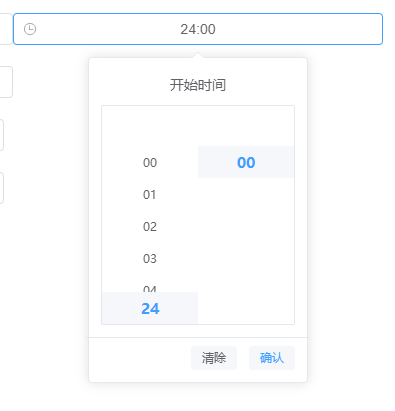
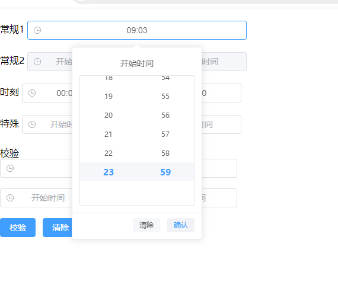
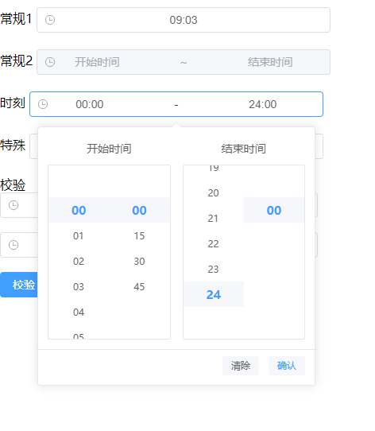
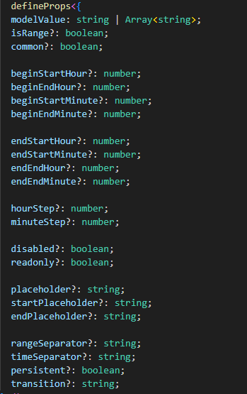

基于vue3、element-plus的时刻选择器， 支持24:00
支持校验
git: https://github.com/renqiankun/time-moment-picker

    安装
        npm i time-moment-picker

    组件内引入
        import timeMomentPicker from 'time-moment-picker'  
    
    or全局安装
        app.use(timeMomentPicker)

(image-2.png)

